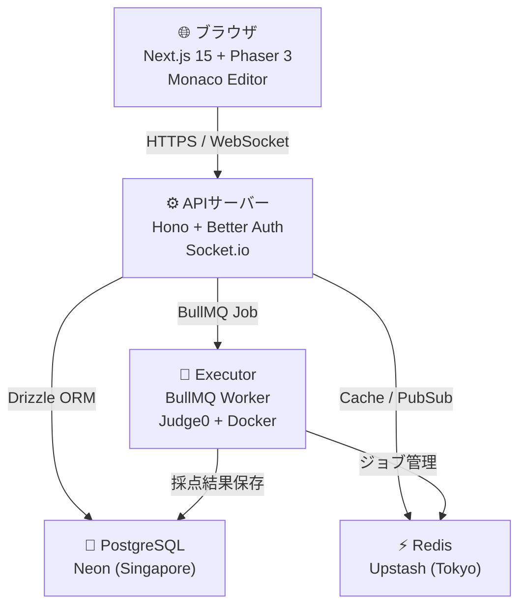
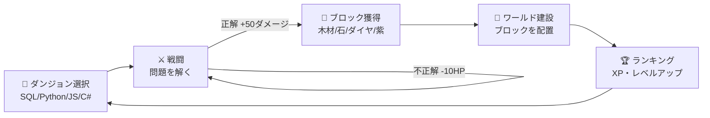
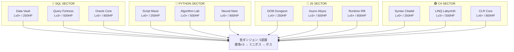
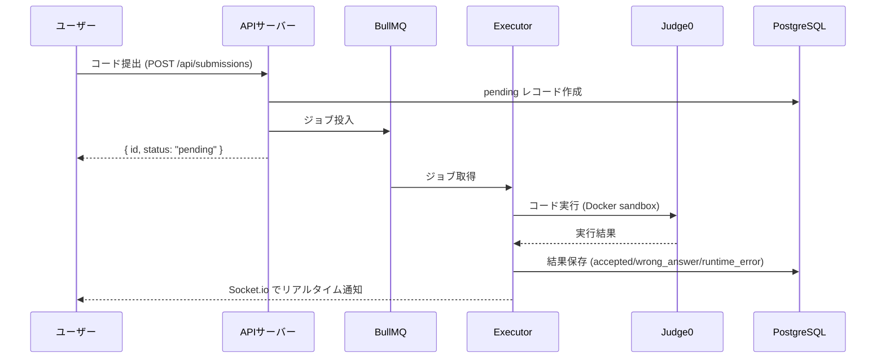
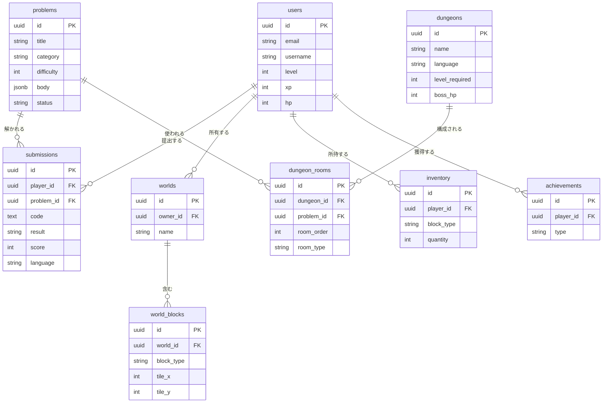
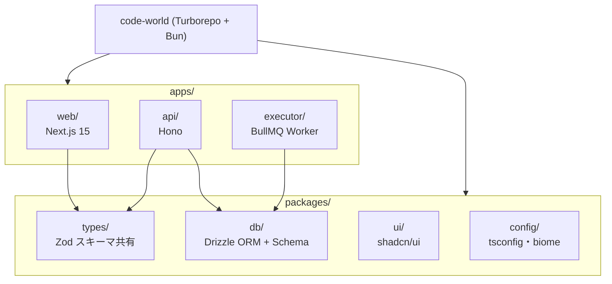
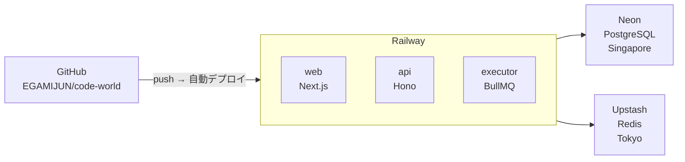

# ⚡ CODE WORLD

> 「コードを書いて、街を作れ。」  
> サイバーパンク世界を舞台にしたダンジョンRPG × 学習型オープンワールドゲーム

🌐 **本番URL**: https://code-worldweb-production.up.railway.app

---

## 🎮 ゲーム概要

SQLやPython・JavaScript・C#の問題を解いてAIボスと戦い、獲得したブロックでサイバーパンク風の街を建設するプログラミング学習ゲーム。

```
ダンジョンに挑む → 問題を解く → ボスを倒す → ブロック獲得 → ワールドに建設 → 他プレイヤーと交流
```

---

## 🏗️ システムアーキテクチャ



---

## 🎯 ゲームループ



---

## 🏰 ダンジョン構造



---

## 💻 コード実行パイプライン



---

## 🗃️ データベース設計



---

## 📦 モノレポ構成



---

## 🚀 デプロイ構成



---

## 🛠️ 技術スタック

| レイヤー | 技術 | 用途 |
|---------|------|------|
| フロント | Next.js 15 + TypeScript | App Router + RSC |
| ゲームエンジン | Phaser 3 | アイソメトリック2Dワールド |
| コードエディタ | Monaco Editor | VS Codeと同じエンジン |
| バックエンド | Hono | 型安全RPC API |
| 認証 | Better Auth | GitHub OAuth + メール認証 |
| ORM | Drizzle ORM | 型安全SQL |
| キュー | BullMQ | コード採点ジョブ管理 |
| コード実行 | Judge0 + Docker | セキュアサンドボックス |
| DB | PostgreSQL (Neon) | 全データ永続化 |
| キャッシュ | Redis (Upstash) | BullMQ + リーダーボード |
| リアルタイム | Socket.io | マルチプレイヤー位置同期 |
| パッケージ管理 | Bun | npm比10倍速 |
| モノレポ | Turborepo | ビルドキャッシュ・並列実行 |
| デプロイ | Railway | 全サービス自動デプロイ |

---

## ⚔️ 戦闘バランス

| パラメータ | 値 |
|-----------|-----|
| プレイヤー初期HP | 200 |
| ボス攻撃間隔 | 15秒 |
| ボス攻撃ダメージ | 5 |
| 正解時ボスダメージ | 50 |
| 不正解時ダメージ | 10 |
| Lv.0問題XP | +50 |
| Lv.1問題XP | +100 |
| Lv.2問題XP | +150 |
| Lv.3問題XP | +200 |

---

## 🏃 ローカル開発

```bash
# 必要: Bun 1.3.14 + Docker Desktop

git clone https://github.com/EGAMIJUN/code-world
cd code-world
cp .env.example .env
docker compose up -d          # PostgreSQL(5434) + Redis(6379)
bun install
cd packages/db && DATABASE_URL=... bunx drizzle-kit push
DATABASE_URL=... bun src/seed.ts
cd ../..
bun run dev                   # web:3000 / api:3001 / executor
```

---

*Built by EGAMIJUN with Claude Code (Sonnet 4.6)*
